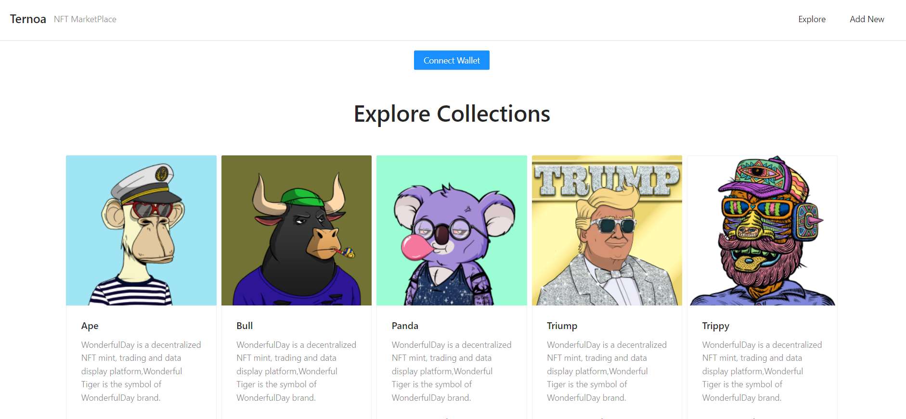

# NFT-React-App

> NFt Marketplace where you can explore new NFT's and buy them and add it to you portfolio.

---

## Live Demo

[FlipCart Website](https://deploy-preview-4--peaceful-meninsky-cc6a1e.netlify.app)

## Screen-Shot

## Built With

- React
- JavaScript
- CSS
- Ant Design
- Redux
- VsCode
  
## Getting Started

To get a local copy of this project just do the following:

- Clone the repository using `https://github.com/Hector096/NFT-React-App.git`
- Browse into the project's directory using `cd NFT-React-App`
- Install all the dependencies using `npm install`
- Start the server using `npm start`

## Authors

👤 **Vishal Verma**

- GitHub: [@Hector096](https://github.com/Hector096)
- LinkedIn: [@hector096](https://www.linkedin.com/in/hector096/)

## 🤝 Contributing

Contributions, issues, and feature requests are welcome!

Feel free to check the [issues page](https://github.com/Hector096/NFT-React-App/issues).

## Show your support

Give a ⭐️ if you like this project!
